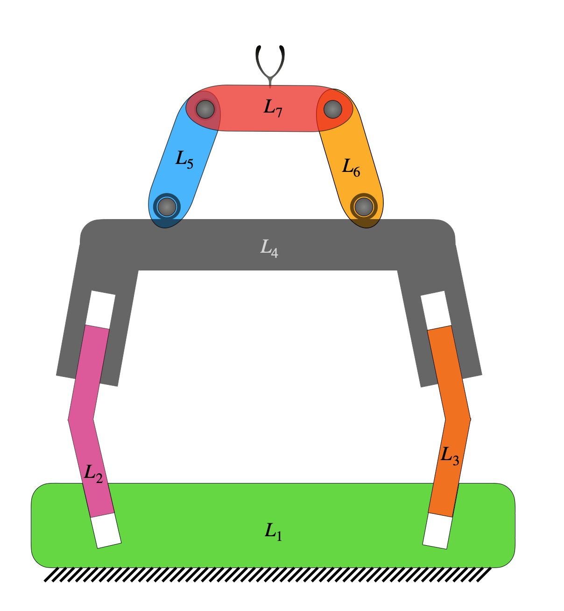

# Formulation of Jacobian for 4R-4P serial-parallel hybrid manipulator as an example

## Figure

<p align="center">
    
</p>

A figure of RRRRPPPP planar serial-parallel hybrid manipulator is shown above. The corresponding adjacency matrix is given by

$$\bf{M} = \left[\begin{matrix}L_1 & P & P & O & O & O & O\\\\A & L_2 & O & P & O & O & O\\\\A & O & L_3 & P & O & O & O\\\\O & O & O & L_4 & R & R & O\\\\O & O & O & A & L_5 & O & R\\\\O & O & O & O & O & L_6 & R\\\\O & O & O & O & O & O & L_7\end{matrix}\right]$$

## Usage

### Jacobian for planar manipulators

The topological information of a robot is to be specified by using its robot-topology matrix, as defined [here](Robot_Topology_Matrix.md). For RRRRPPPP planar serial-parallel hybrid manipulator shown above, the robot topology matrix is given by

$$\left[\begin{matrix}9 & 2 & 2 & 0 & 0 & 0 & 0\\\\1 & 9 & 0 & 2 & 0 & 0 & 0\\\\1 & 0 & 9 & 2 & 0 & 0 & 0\\\\0 & 0 & 0 & 9 & 1 & 1 & 0\\\\0 & 0 & 0 & 1 & 9 & 0 & 1\\\\0 & 0 & 0 & 0 & 0 & 9 & 1\\\\0 & 0 & 0 & 0 & 0 & 0 & 9\end{matrix}\right]$$

The corresponding Jacobian function can be formulated as follows.

Firstly, the required functions are imported as shown below.
```py
from acrod.functions import jacobian
from numpy import array
```


The robot-topology matrix for 3R planar serial manipulator is defined and jacobian information is processed via the imported jacobian class as follows.
```py
M = numpy.array(
        [[9, 2, 2, 0, 0, 0, 0],
         [1, 9, 0, 2, 0, 0, 0],
         [1, 0, 9, 2, 0, 0, 0],
         [0, 0, 0, 9, 1, 1, 0],
         [0, 0, 0, 1, 9, 0, 1],
         [0, 0, 0, 0, 0, 9, 1],
         [0, 0, 0, 0, 0, 0, 9]]
    )
jac = jacobian(M, robot_type = 'planar')
```


Jacobian function is generated as shown below.
```py
jacobian_function = jac.get_jacobian_function()
```


In the process of generating the above jacobian function, other attributes of the jacobian object also are updated. Symbolic Jacobian matrices can be extracted from the attributes. Since this is a non-serial robot, there would be four matrices required to compute the Jacobian, which are $J_a$, $J_p$, $A_a$ and $A_p$. These can be extracted by the attributes `Ja`, `Jp`, `Aa` and `Ap`, respectively, as shown below.

```py
symbolic_Ja = jac.Ja
symbolic_Ja
```

Output in Jupyter notebook:

$$\left[\begin{matrix}\cos{\left(\phi_{(1,2)} \right)} & 0 & - a_{y} + r_{(4,5)y}\\\\\sin{\left(\phi_{(1,2)} \right)} & 0 & a_{x} - r_{(4,5)x}\\\\0 & 0 & 1\end{matrix}\right]$$

```py
symbolic_Jp = jac.Jp
symbolic_Jp
```
Output in Jupyter notebook:

$$\left[\begin{matrix}\cos{\left(\phi_{(2,4)} \right)} & 0 & 0 & - a_{y} + r_{(5,7)y} & 0\\\sin{\left(\phi_{(2,4)} \right)} & 0 & 0 & a_{x} - r_{(5,7)x} & 0\\0 & 0 & 0 & 1 & 0\end{matrix}\right]$$

```py
symbolic_Aa = jac.Aa
symbolic_Aa
```
Output in Jupyter notebook:

$$\left[\begin{matrix}0 & 0 & a_{y} - r_{(4,5)y}\\0 & 0 & - a_{x} + r_{(4,5)x}\\- \cos{\left(\phi_{(1,2)} \right)} & \cos{\left(\phi_{(1,3)} \right)} & 0\\- \sin{\left(\phi_{(1,2)} \right)} & \sin{\left(\phi_{(1,3)} \right)} & 0\\0 & 0 & -1\end{matrix}\right]$$
```py
symbolic_Ap = jac.Ap
symbolic_Ap
```
Output in Jupyter notebook:

$$\left[\begin{matrix}0 & 0 & - a_{y} + r_{(4,6)y} & a_{y} - r_{(5,7)y} & - a_{y} + r_{(6,7)y}\\\\0 & 0 & a_{x} - r_{(4,6)x} & - a_{x} + r_{(5,7)x} & a_{x} - r_{(6,7)x}\\\\- \cos{\left(\phi_{(2,4)} \right)} & \cos{\left(\phi_{(3,4)} \right)} & 0 & 0 & 0\\\\- \sin{\left(\phi_{(2,4)} \right)} & \sin{\left(\phi_{(3,4)} \right)} & 0 & 0 & 0\\\\0 & 0 & 1 & -1 & 1\end{matrix}\right]$$

Since this is a serial robot, the matrix $J_a$ itself would be the Jacobian matrix of the manipulator. The matrix $J_a$ is extracted from `Ja` attribute of the jacobian object as follows.
```py
symbolic_jacobian = jac.Ja
symbolic_jacobian
```

In an ipynb file of JupyterLab, the above code would produce the following output.

$$\left[\begin{matrix}- a\_{y} + r\_{(1,2)y} & - a\_{y} + r\_{(2,3)y} \\\\ a\_{x} - r\_{(1,2)x} & a\_{x} - r\_{(2,3)x} \\\\ 1 & 1\end{matrix}\right]$$

The above Jacobian is based on the notations defined and described [here](Notation_and_Nomenclature.md).

Active joint velocities, in the corresponding order, can be viewed by running the following lines.
```py
active_joint_velocities = jac.active_joint_velocities_symbolic
active_joint_velocities
```

In an ipynb file of JupyterLab, the above code would produce the following output.

$$\left[\begin{matrix}\dot{\theta}\_{(1,2)} \\\\ \dot{\theta}\_{(2,3)}\end{matrix}\right]$$

Robot dimensional parameters can be viewed by running the below line.
```py
robot_dimensional_parameters = jac.parameters_symbolic
robot_dimensional_parameters
```

In an ipynb file of JupyterLab, the above code would produce the following output.

$$\left[\begin{matrix}r_{(1,2)x} \\\\ r_{(1,2)y} \\\\ r_{(2,3)x} \\\\ r_{(2,3)y}\end{matrix}\right]$$


Robot end-effector parameters can be viewed by running the below line.
```py
robot_endeffector_parameters = jac.endeffector_variables_symbolic
robot_endeffector_parameters
```

In an ipynb file of JupyterLab, the above code would produce the following output.

$$\left[\begin{matrix}a_{x} \\\\ a_{y}\end{matrix}\right]$$

#### Sample computation of Jacobian for the configuration corresponding to the parameters shown below:

- End-effector point: $\textbf{a}=\hat{i}+2\hat{j}$
- Locations of joints: $\textbf{r}\_{(1,2)}=3\hat{i}+4\hat{j}$ and $\textbf{r}\_{(2,3)}=5\hat{i}+6\hat{j}$

For the given set of dimensional parameters of the robot, the numerical Jacobian can be computed as follows. Firstly, we need to gather the configuration parameters in Python list format, in a particular order. The robot dimensional parameters from `jac.parameters_symbolic` are found (as shown earlier) to be in the order of $r_{(1,2)x}$, $r_{(1,2)y}$, $r_{(2,3)x}$ and $r_{(2,3)y}$. Hence the configuration parameters are to be supplied in the same order, as a list. Thus, the computation can be performed as shown below.
```py
end_effector_point = [1,2]
configuration_parameters = [3,4,5,6]
jacobian_at_the_given_configuration = jacobian_function(end_effector_point, configuration_parameters)
jacobian_at_the_given_configuration
```

The output produced by running the above code, is shown below.
```py
array([[ 2,  4],
       [-2, -4],
       [ 1,  1]])
```

## Community Guidelines

- For contribution to the software:
  - In order to contribute to the software, please consider using the [pull request feature](https://github.com/suneeshjacob/ACRoD/issues) of GitHub.
- For reporting issues with the software:
  - For reporting issues or problems, please use [issues](https://github.com/suneeshjacob/ACRoD/issues).
- For support:
  - For any further support (including installation, usage, etc.), feel free to contact via suneeshjacob-at-gmail-dot-com.
