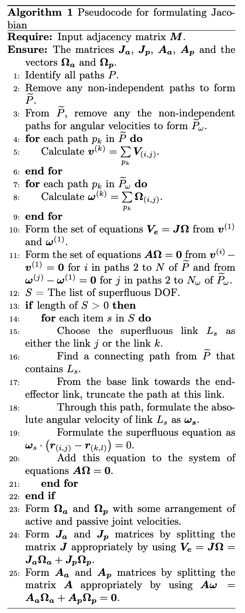
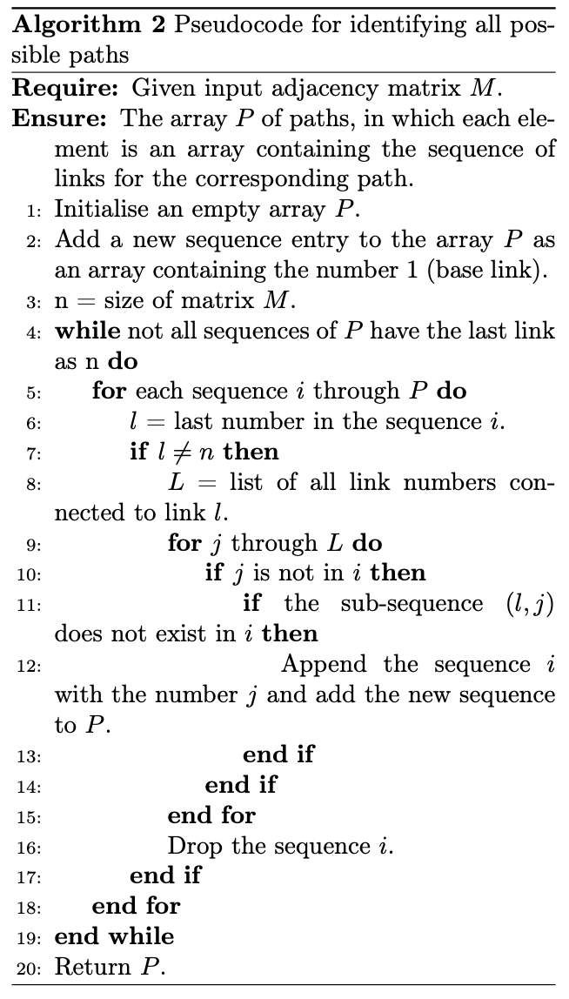
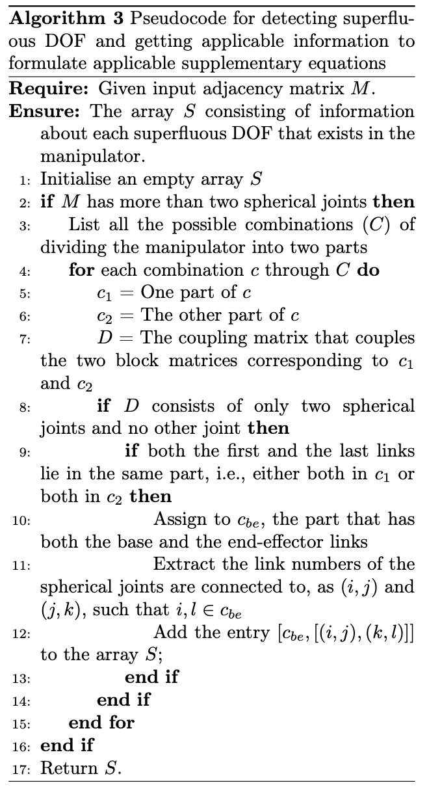

## Steps to formulate Jacobian

The approach is that is typically used to formulate Jacobian of a serial manipulator is to simply calculate the individual contributions of each of the joints to the end-effector along the path that connects the base-link and the end-effector link. Since in case of parallel manipulators multiple paths that join the base link and the end-effector link exist, the same concept [[1]](#1) is used for all the connecting paths from the base-link to the end-effector link. But not all joint velocities through these paths are actually independent but instead the passive joint velocities are supposed to be dependent on the active joint velocities.

Formulation of Jacobian is done by the following steps:

1) Identification of all connecting paths from the base link to the end-effector link.

2) Reduction of the paths to independent paths for linear velocities.

3) Further reduction of paths to non-trivial ones in the context of angular velocities.

4) Calculation of the contributions of linear velocities through each of the independent paths and the contributions of angular velocities through each of the independent and non-trivial paths, and calculation of their sums for each path.

5) Formulation of the velocity of the end-effector by using the first sums of the linear and angular velocity contributions.

6) Formulation of constraint equations by taking the rest of the sums with the first sum, of each of linear and angular velocities.

7) Checking for superfluous DOF and formulate the supplementary equations if applicable.

8) Fomulation of the matrices $\mathbf{J_a}$, $\mathbf{J_p}$, $\mathbf{A_a}$ and $\mathbf{A_p}$.

In step 1, all the paths from base link to the end-effector link are identified. Each path is nothing but an ordered array of links that start from 1 (the base link) and end at $N$ (the end-effector link), where $N$ is the number of links. The set of all paths can be found by taking an empty list and adding the base link sequence and finding all the links that are connected to that link and adding the link to form a new sequence as long as the sub-sequence is not repeated while adding a new link, and repeating this process until all the sequences in the list reach the end-effector link. This is shown in compact form in algorithm \ref{alg:paths}.

In step 2, a set of independent paths are to be selected from the set of all paths. This can be done by formulating the matrix $[\mathbf{C\_{V}}]$ and finding the echelon form of its transpose and choosing the pivoted column indices and choosing the paths corresponding to these indices as a set of independent paths.

In step 3, a set of non-trivial paths are to be selected from the set of independent paths. Non-trivial paths, in the context of angular velocities, are the paths that are trivial for angular velocity formulation, due to the presence of prismatic joints and planar joints, as prismatic joints and planar joints do not contribute to the angular velocity of the end-effector. These can be found by taking the $\mathbf{\Omega}\_{(i,j)}$ values corresponding to prismatic joints and planar joints as zeroes and finding the independent paths of the corresponding coefficient matrix. In the matrix $[\mathbf{C_{V}}]$, all the columns corresponding to prismatic joints and planar joints are removed to form the new reduced coefficient matrix $[\mathbf{C_{\Omega}}]$. Now, finding the echelon form of the transpose of this matrix gives the pivoted column indices, which would be the set of independent and non-trivial paths in the context of angular velocities.

In step 4, the formulation of linear velocity of the end-effector through each path of $\widetilde{P}$ is given by the sum of contributions of linear velocities to the end-effector from all the joints through that path. Likewise, the formulation of angular velocity of the end-effector through each path of $\widetilde{P}\_{\omega}$ is given by the sum of contributions of angular velocities to the end-effector from all the joints through that path. If $\mathbf{a}$ = $\\{a_x, a_y, a_z\\}^T$ is the end-effector point, the contributions of linear velocity and angular velocity to the end-effector from a joint connected by the links $i$ and $j$ are denoted by $\mathbf{V}\_{(i,j)}$ and $\mathbf{\Omega}\_{(i,j)}$ respectively, and for each type of joint they are given as shown in table \ref{velocities}.

## A table

| Type | $\mathbf{\Omega}_{(i,j)}$ | $\mathbf{V}_{(i,j)}$ |
| :----:  | :---:     | :---: |
|$R$ | $\dot{\theta}\_{(i,j)}\mathbf{\hat{n}}\_{(i,j)}$ | $\dot{\theta}\_{(i,j)}\mathbf{\hat{n}}\_{(i,j)}\times \left(\mathbf{a}-\mathbf{r}\_{(i,j)}\right)$  |
|$P$ | 0 | $\dot{d}\_{(i,j)}\mathbf{\hat{n}}\_{(i,j)}$ |
|$C$ | $\dot{\theta}\_{(i,j)}\mathbf{\hat{n}}\_{(i,j)}$ | $\dot{\theta}\_{(i,j)}\mathbf{\hat{n}}\_{(i,j)}\times \left(\mathbf{a}-\mathbf{r}\_{(i,j)}\right) + \dot{d}\_{(i,j)}\mathbf{n}\_{(i,j)}$  |
|$S$ | $\mathbf{\omega}\_{(i,j)}$ | $\mathbf{\omega}\_{(i,j)} \times \left( \mathbf{a} - \mathbf{r}\_{(i,j)}\right)$  |
|$U$ | $\dot{\gamma}\_{(i,j)}\mathbf{\hat{m}}\_{(i,j)}+\dot{\theta}\_{(i,j)}\mathbf{\hat{n}}\_{(i,j)}$ | $\left(\dot{\gamma}\_{(i,j)}\mathbf{\hat{m}}\_{(i,j)}+\dot{\theta}\_{(i,j)}\mathbf{\hat{n}}\_{(i,j)}\right)\times \left(\mathbf{a}-\mathbf{r}\_{(i,j)}\right)$  |
|$H$ | $\dot{\theta}\_{(i,j)}\mathbf{\hat{n}}\_{(i,j)}$ | $\dot{\theta}\_{(i,j)}\mathbf{\hat{n}}\_{(i,j)}\times \left(\mathbf{a}-\mathbf{r}\_{(i,j)}\right)+\frac{p}{2\pi}\dot{\theta}\_{(i,j)}\mathbf{\hat{n}}\_{(i,j)}$  |
|$F$ | 0 | $\dot{d}\_{(i,j)}\mathbf{\hat{n}}\_{(i,j)}$ |

Hence, for each $\text{k}^{\text{th}}$ path $p_k$ in $\widetilde{P}$, the linear velocity of the end-effector is given by $\mathbf{v^{(k)}} = \sum\limits_{p_k} \mathbf{V}\_{(i,j)}$, and likewise, for each $\text{k}^{\text{th}}$ path $p_k$ in $\widetilde{P}$, the linear velocity of the end-effector is given by $\mathbf{\omega^{(k)}} = \sum\limits_{p_k} \mathbf{\Omega}\_{(i,j)}$.

In step 5, the velocity vector of the end-effector is formulated by using $\mathbf{v}^{(1)}$ and $\mathbf{\omega}^{(1)}$, as shown in equation \eqref{eq:velocities_v1}. This would be a function of not just the active joint velocities but also the passive joint velocities, and hence it is not sufficient to derive the Jacobian matrix. The passive joints are to be written in terms of active joint angles in order to be able to derive the Jacobian matrix.

$$\mathbf{V_e} = \begin{Bmatrix} \mathbf{v} \\\\ \mathbf{\omega} \end{Bmatrix} = \begin{Bmatrix} \mathbf{v}^{(1)} \\\\ \mathbf{\omega}^{(1)} \end{Bmatrix} = \mathbf{J}\mathbf{\Omega} = \mathbf{J_a}\mathbf{\Omega_a}+\mathbf{J_p}\mathbf{\Omega_p} \tag{1}$$

In step 6, the constraints equations are formed by considering $\mathbf{v^{(i)}}-\mathbf{v}^{(1)}=0$ for all $i\neq 1$ and $\mathbf{\omega^{(j)}}-\mathbf{\omega}^{(1)}=0$ for all $j\neq 1$. These form a linear system of equations in active and passive joint velocities as shown in equation \eqref{eq:velocities_v2toN}, from which the passive joint velocities can be written in terms of active joint velocities as shown in equation \eqref{eq:passiveintermsofactive}.

$$\begin{Bmatrix} \mathbf{v}^{(2)}-\mathbf{v}^{(1)} \\\\ \mathbf{v}^{(3)}-\mathbf{v}^{(1)} \\\\ \vdots \\\\ \mathbf{v}^{(N_{\mathbf{v}})}-\mathbf{v}^{(1)} \\\\ \mathbf{\omega}^{(2)}-\mathbf{\omega}^{(1)} \\\\ \mathbf{\omega}^{(3)}-\mathbf{\omega}^{(1)} \\\\ \vdots \\\\ \mathbf{\omega}^{(N_{\mathbf{\omega}})}-\mathbf{\omega}^{(1)} \end{Bmatrix} = \mathbf{A}\mathbf{\Omega} = \mathbf{A_a}\mathbf{\Omega_a}+\mathbf{A_p}\mathbf{\Omega_p} = \mathbf{0} \tag{2}$$

In step 7, the existence of superfluous DOF(s), if any, is idenified. In the context of this paper, a superfluous DOF is DOF that does not each the end-effector of the robot by virtue of its inherent mechanism arrangement rather than any particular configuration. Jacob et al. [[2]](#2) mentioned in their paper that, for revolute, prismatic, cylindrical and spherical types of joints, two links connected by two joints cannot guarantee relative motion for arbitrary locations and orientations of axes of the joints, except in case of a spherical-spherical pair. Even with the inclusion of universal and helical joints, the spherical-spherical pair would be the only case in which two links can have guaranteed relative motion for arbitrary locations and orientations of the joints. Another way of looking at it is that if a link (or a set of links) is fixed (unmovable), then another link (or set of links) having connected to this link by some joints of arbitrary location and orientation, and being able to have relative motion with this link (or the set of links), would be possible only in case of a spherical-spherical connection. With this concept, it can be said that the possibility of superfluous DOF exists only in case of two spherical joints, as this is a motion that occurs even when all the links connected to it are fixed (stationary). Since this paper considers only revolute and prismatic actuators, the joint velocities of spherical joints are always passive, and hence a superfluous DOF cannot be actively controlled. In some cases, the existence of superfluous DOF makes it impossible to completely control the complete velocity of the end-effector, in which case the robot would be uncontrollable. But in some other cases, the existence of superfluous DOF does not affect the velocity of the end-effector. The method used in the earlier study [[1]](#1) is used to appropriately address the superfluous DOF case in Jacobian formulation.

The identification of the existence of superfluous DOF is made by firstly checking whether the manipulator has at least two spherical joints. If the manipulator does not have at least two spherical joints then a superfluous DOF (in the context of this study) does not exist. But if the manipulator has two or more spherical joints, then the whole set of links of the manipulator are split into two mutually exhaustive sets in all possible (independent) combinations, and for each combination of two sets of links, whether or not the corresponding two parts of the manipulator are connected by two spherical joints (and no other joint) is checked. This can be done by extracting the coupling matrix of these two sets of links from the adjacency matrix and counting the total number of joints and the number of spherical joints in it. If the total number of joints and the number of spherical joints of the coupling matrix equal to 2, then those two parts of the manipulator are said to have an uncontrollable DOF. If base link and the end-effector link both happen to lie on one of the two sets (unlike the other case of the base link lying on one set and the end-effector link lying on the other set), it is said to be not affecting the velocity of the end-effector. If $c_{be}$ is the set of links that contains both the base and the end-effector links, and if $(i,j)$ and $(k,l)$ are the links connected by these two spherical joints such that $i$ and $l$ lie in $c_{be}$, then this would give the information related to the superfluous DOF. Hence, for all possible independent combinations, this is checked and for each applicable case, the superfluous DOF is collected in the set $S$. These steps are concisely put forth in the pseudocode shown in algorithm \ref{alg:superfluous}.

If the set $S$ is non-empty then for each element (of the form $\left[c_{be},\left[(i,j),(k,l)\right]\right]$) in the set $S$, either the link $j$ or the link $k$ is chosen as the link $L_s$, and the absolute angular velocity of that link is formulated by taking a connecting path (from the base link to the end-effector link) that has this link and truncating the path at this link and formulating the angular velocity of $L_s$ through this truncated path, as $\mathbf{\omega_s}$.

Once the set $c_{be}$ (the set of links connected to the rest of the mechanism by two spherical joints alone) is identified, the angular velocity of one of the links connecting to one of the spherical joints about the axis passing through the two spherical joints is to be set to zero (This equation does not represent the true velocity and is only to accommodate calculations simpler). This can be achieved by equation \eqref{eq:supfludofeqn}, where $\vec{\omega}\_{k}$ is the absolute velocity of the link if it is the case of a single link (and is the absolute velocity of any link that is connected to one of the spherical joints if it is the case of a set of links), $\mathbf{r}\_{(i,j)}$ and $\mathbf{r}\_{kl}$ are the position vectors of the two spherical joints.

$$\mathbf{\omega_{s}}\cdot \left(\mathbf{r}_{(i,j)}-\mathbf{r}_{(k,l)}\right) = 0 \tag{3}$$

In step 8, $\mathbf{\Omega_a}$ and $\mathbf{\Omega_p}$ are chosen, and the equations $\mathbf{V_e} = \mathbf{J}\mathbf{\Omega}$ and $\mathbf{A}\mathbf{\Omega} = \mathbf{0}$ can be split appropriately to form the matrices $\mathbf{J_a}$, $\mathbf{J_p}$, $\mathbf{A_a}$ and $\mathbf{A_p}$, as shown in equations \eqref{eq:active} and \eqref{eq:passiveintermsofactive}. The Jacobian can be formulated using these four matrices as shown in equation \eqref{eq:jacobian_parallel}. For serial manipulators, the matrices $\mathbf{J_p}$, $\mathbf{A_a}$ and $\mathbf{A_p}$ do not come into picture. Hence the Jacobian for serial manipulators is as shown in equation \eqref{eq:jacobian_serial}.

$$\mathbf{V_e} = \mathbf{J}\mathbf{\Omega} = \mathbf{J_a}\mathbf{\Omega_a}+\mathbf{J_p}\mathbf{\Omega_p} \tag{4}$$

$$\mathbf{A}\mathbf{\Omega} = \mathbf{A_a}\mathbf{\Omega_a} + \mathbf{A_p}\mathbf{\Omega_p} = \mathbf{0} \\
        \Rightarrow \mathbf{\Omega_p}=-\mathbf{A^{-1}_p}\mathbf{A_a}\mathbf{\Omega_a} \tag{5}$$

$$\mathbf{V_e} = \mathbf{J}\mathbf{\Omega} = \mathbf{J_a}\mathbf{\Omega_a}+\mathbf{J_p}\left(-\mathbf{A^{-1}_p}\mathbf{A_a}\mathbf{\Omega_a}\right) = \left(\mathbf{J_a}-\mathbf{J_p}\mathbf{A^{-1}_p}\mathbf{A_a}\right)\mathbf{\Omega_a} = \mathbf{\widetilde{J}}\mathbf{\Omega_a} \tag{6}$$

$$\mathbf{\widetilde{J}} = \mathbf{J_a}-\mathbf{J_p}\mathbf{A^{-1}_p}\mathbf{A_a} \tag{7}$$

$$\mathbf{\widetilde{J}} = \mathbf{J_a} \tag{8}$$

The above steps of the algorithm are concisely shown in the pseudocode of algorithm \ref{alg:jacobian}.

1. Assert: Type(_iterator_) is Object.
1. Assert: _completion_ is a Completion Record.
1. Let _hasReturn_ be HasProperty(_iterator_, `"return"`).
1. ReturnIfAbrupt(_hasReturn_).
  1. If _hasReturn_ is *true*, then
    1. Let _innerResult_ be Invoke(_iterator_, `"return"`, ( )).
    1. If _completion_.[[type]] is not ~throw~ and _innerResult_.[[type]] is ~throw~, then
      1. Return _innerResult_.
1. Return _completion_.

    

    

    

This algorithm can be used to find the four matrices $\mathbf{J_a}$, $\mathbf{J_p}$, $\mathbf{A_a}$ and $\mathbf{A_p}$, from which the Jacobian can be formulated as $\mathbf{\widetilde{J}}=\mathbf{J_a}-\mathbf{J_p}\mathbf{A^{-1}_p}\mathbf{A_a}$. For serial manipulators, since passive joints do not come into picture, the Jacobian would simply be $\mathbf{\widetilde{J}}=\mathbf{J_a}$.

## References
<a id="1">[1]</a> 
Jacob, Akkarapakam Suneesh, and Bhaskar Dasgupta. "Dimensional synthesis of spatial manipulators for velocity and force transmission for operation around a specified task point." arXiv preprint arXiv:2210.04446 (2022).

<a id="2">[2]</a> 
Jacob, Akkarapakam Suneesh, Bhaskar Dasgupta, and Rituparna Datta. "Enumeration of spatial manipulators by using the concept of Adjacency Matrix." arXiv preprint arXiv:2210.03327 (2022).
