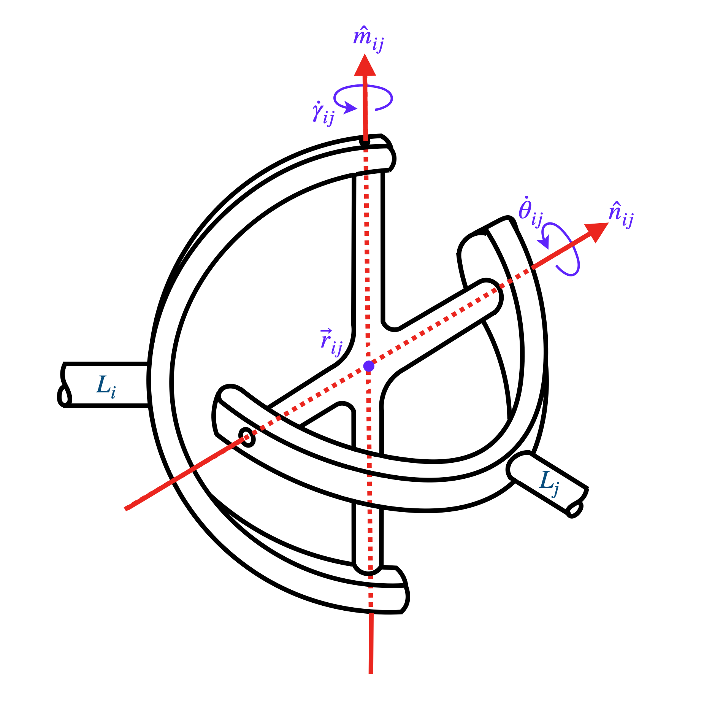

## Notation for describing the parameters of spatial manipulators

The notations presented in this document are modified versions of the notations mentioned in [[1]](#1), which can be formulated directly from the [robot-topology matrix](Robot_Topology_Matrix.md), a is a modified form of matrix-based representation of robots mentioned in [[2]](#2). The notations are explained below in detail.

The robot-topology matrix considered in this study consists of the diagonal elements corresponding to the links of the manipulator, in which the first diagonal element corresponds to the base link and the last diagonal element corresponds to the end-effector link of the manipulator. The upper off-diagonal elements correspond to the joints that the corresponding links are connected with. The types of joints considered are revolute, prismatic, cylindrical, spherical, universal and plane joints. The parameters required to describe each joint are discussed below in detail.

The position of the joint of a manipulator connecting the two links $i$ and $j$, is given by equation (1).

$$\mathbf{r}_{(i,j)}=r_{(i,j)x}\mathbf{\hat{i}}+r_{(i,j)y}\mathbf{\hat{j}}+r_{(i,j)z}\mathbf{\hat{k}} \tag{1}$$

In order to fully describe a revolute joint or a prismatic joint or a cylindrical joint, apart from its position ($\mathbf{r}\_{(i,j)}$), the orientation of the axis of its appropriate motion ($\mathbf{\hat{n}}\_{(i,j)}$) needs to be specified. For a revolute joint, the appropriate motion would be revolute motion, and for a prismatic joint, the appropriate motion would be translatory motion. On the other hand, for a cylindrical joint, the appropriate motion consists of both revolute and translatory motions along the same axis. While specifying one axis is sufficient for a revolute, prismatic or cylindrial joint (apart from the position), it is required to specify two mutually perpendicular axes for a universal joint, namely $\mathbf{\hat{m}}\_{(i,j)}$ and $\mathbf{\hat{n}}\_{(i,j)}$, as shown in figure \ref{universaljoint}. And in order to specify a helical joint, apart from its position ($\mathbf{r}\_{(i,j)}$), the orientation of its axis ($\mathbf{\hat{n}}\_{(i,j)}$) and the pitch ($p\_{ij}$) of the helix are to be specified. Alternatively, the helix angle can also be specified, from which the pitch of the helix can be calculated. Finally, in order to specify a plane joint, apart from its position, the orientation of the axis perpendicular to the plane ($\mathbf{\hat{m}}\_{(i,j)}$) is to be specified.

    

In case of universal joints, the vectors $\mathbf{\hat{m}}\_{(i,j)}$ and $\mathbf{\hat{n}}\_{(i,j)}$ are unit vectors, each of which describes the corresponding axis of rotation/translation. The components in the global frame of reference are shown in equations (2) and (3). 

$$\mathbf{\hat{n}}_{(i,j)}=n_{(i,j)x}\mathbf{\hat{i}}+n_{(i,j)y}\mathbf{\hat{j}}+n_{(i,j)z}\mathbf{\hat{k}} \tag{2}$$

$$\mathbf{\hat{m}}_{(i,j)}=m_{(i,j)x}\mathbf{\hat{i}}+m_{(i,j)y}\mathbf{\hat{j}}+m_{(i,j)z}\mathbf{\hat{k}} \tag{3}$$

Since these are unit vectors, they have to satisfy the equations shown in (4) and (5). This can be achieved by writing the elements of the unit vector in terms of two independent variables, as shown in equations (9) and (12). And since $\mathbf{\hat{m}}\_{(i,j)}$ occurs only in case of universal joint wherein it is always perpendicular to its companion axis $\mathbf{\hat{n}}\_{(i,j)}$, the elements of those unit vectors should also satisfy equation (6). Also in case of plane joints, $\mathbf{\hat{m}}\_{(i,j)}$ is the unit vector normal to the plane, and $\mathbf{\hat{n}}\_{(i,j)}$ is the unit vector along which instantaneous planar translation takes place, and hence the inner product of the two unit vectors $\mathbf{\hat{m}}\_{(i,j)}$ and $\mathbf{\hat{n}}\_{(i,j)}$ should always be zero. Therefore, equations (4), (5) and (6) are applicable in the case of plane joints as well.

$$n_{(i,j)x}^2+n_{(i,j)y}^2+n_{(i,j)z}^2=1 \tag{4}$$

$$m_{(i,j)x}^2+m_{(i,j)y}^2+m_{(i,j)z}^2=1 \tag{5}$$

$$m_{(i,j)x}n_{(i,j)x}+m_{(i,j)y}n_{(i,j)y}+m_{(i,j)z}n_{(i,j)z}=0 \tag{6}$$

$$n_{(i,j)x} = \sin{\left(\beta_{(i,j)}\right)}\cos{\left(\phi_{(i,j)}\right)} \tag{7}$$

$$n_{(i,j)y} = \sin{\left(\beta_{(i,j)}\right)}\sin{\left(\phi_{(i,j)}\right)} \tag{8}$$

$$n_{(i,j)z} = \cos{\left(\beta_{(i,j)}\right)} \tag{9}$$

$$m_{(i,j)x} = \sin{\left(\alpha_{(i,j)}\right)}\cos{\left(\delta_{(i,j)}\right)} \tag{10}$$

$$m_{(i,j)y} = \sin{\left(\alpha_{(i,j)}\right)}\sin{\left(\delta_{(i,j)}\right)} \tag{11}$$

$$m_{(i,j)z} = \cos{\left(\alpha_{(i,j)}\right)} \tag{12}$$

This reduces the six parameters, i.e., $m_{(i,j)x}$, $m_{(i,j)y}$, $m_{(i,j)z}$, $n_{(i,j)x}$, $n_{(i,j)y}$ and $n_{(i,j)z}$ into four parameters, i.e., $\alpha_{(i,j)}$, $\delta_{(i,j)}$, $\beta_{(i,j)}$ and $\phi_{(i,j)}$. But there are only three independent parameters. By putting these in the equality constraint shown in equation (6), we get

$$\begin{array}{cc}\left(\sin{\left(\alpha_{(i,j)}\right)}\cos{\left(\delta_{(i,j)}\right)}\right)\left(\sin{\left(\beta_{(i,j)}\right)}\cos{\left(\phi_{(i,j)}\right)}\right)
\\
+\left(\sin{\left(\alpha_{(i,j)}\right)}\sin{\left(\delta_{(i,j)}\right)}\right)\left(\sin{\left(\beta_{(i,j)}\right)}\sin{\left(\phi_{(i,j)}\right)}\right)
\\
+\left(\cos{\left(\alpha_{(i,j)}\right)}\right)\left(\cos{\left(\beta_{(i,j)}\right)}\right)=0\end{array}$$

$$\Rightarrow \tan{\left(\alpha_{(i,j)}\right)}\tan{\left(\beta_{(i,j)}\right)}\cos{\left(\delta_{(i,j)}-\phi_{(i,j)}\right)}+1=0$$

$$\Rightarrow \tan{\left(\alpha_{(i,j)}\right)}=-\frac{1}{\tan{\left(\beta_{(i,j)}\right)}\cos{\left(\delta_{(i,j)}-\phi_{(i,j)}\right)}}$$

The range of inverse tangent function would be $[-\pi/2,\pi/2]$. But for uniformity with the ranges of parameters of other joints, $[0,\pi]$ is the preferred range of $\alpha_{(i,j)}$. Hence, $\alpha_{(i,j)}$ is expressed in the form shown in (13), where $\xi$ and $u\left(\xi\right)$ are as shown in (14) and (15), respectively.

$$\alpha_{(i,j)}=\xi+\pi\left(1-u\left(\xi\right)\right) \tag{13}$$

$$\xi=\tan^{-1}{\left(\frac{-1}{\tan{\left(\beta_{(i,j)}\right)}\cos{\left(\delta_{(i,j)}-\phi_{(i,j)}\right)}}\right)} \tag{14}$$

$$u\left(\xi\right)=\begin{cases} 0 & \xi \leq 0 \\ 1 & \xi > 0 \end{cases} \tag{15}$$

For spherical coordinates, the ranges of zenith and azimuth angles are $(0,\pi)$ and $(0,2\pi)$, respectively. However, in the context of describing the axis of for example a revolute joint, the direction of the unit vector does not affect the rotation, and hence, an angular velocity of $\dot{\theta}\_{(i,j)}$ about the axis $\mathbf{n\_{(i,j)}}$ and an angular velocity $-\dot{\theta}\_{(i,j)}$ about the axis $-\mathbf{n\_{(i,j)}}$ are equivalent. Therefore, spanning half of the unit sphere would be sufficient to capture all the possible orientations of the axis. Hence, both the ranges being $(0,\pi)$ would suffice.

$$0\leq\beta_{(i,j)},\phi_{(i,j)},\delta_{(i,j)}\leq\pi \tag{16}$$

Regarding helical joints, in the context of this present study, single-threaded screws are considered with the convention that right-handed threading has positive pitch. Right-handed threading in the context of this study is defined such that when two links are connected by such a joint then the relative rotation of a link with respect to the other about an axis produces translation in the same direction of that axis. If $p\_{ij}$ is the pitch of a helical joint connecting the links $i$ and $j$, then the angular displacement of the screw is related to the linear displacement of the screw by equation (17).

$$d_{(i,j)} = \frac{p_{(i,j)}}{2\pi}\theta_{(i,j)} \tag{17}$$

## Notation for planar manipulators
Planar manipulators are a special case of spatial manipulators and hence the notation of planar manipulators is in some sense a subset of that of spatial manipulators. In planar manipulators, it is assumed that all the motion exists in xy-plane and hence the z-coordinate is 0 for all the position vectors of locations of joints. Thus, for planar manipulators, the equation (1) reduces to the equation (18). 

$$\mathbf{r}\_{(i,j)}=r_{(i,j)x}\mathbf{\hat{i}}+r_{(i,j)y}\mathbf{\hat{j}} \tag{18}$$

In this study, only two types of joints, namely revolute and prismatic are considered. The axis of each revolute joint is always perpendicular to the plane, and hence, for revolute joints of planar manipulators, the equation (2) reduces to the equation (20). And the axis of each prismatic joint should lie within the plane, and hence the z-coordinate of the unit vector along the axis of each prismatic joint would be zero. Thus, for prismatic joints of planar manipulators, the equation (2) reduces to the equation (19), and correspondingly, $n_{(i,j)z}$ being zero conventionally implies $\beta_{(i,j)}=\frac{\pi}{2}$ and $\sin{\beta_{(i,j)}}=1$, thereby reducing equation (9) to equation (21).

$$\mathbf{\hat{n}}_{(i,j)} = n_{(i,j)x}\mathbf{\hat{i}}+n_{(i,j)y}\mathbf{\hat{j}} \tag{19}$$

$$\mathbf{\hat{n}}_{(i,j)} = \mathbf{\hat{k}} \tag{20}$$

$$\begin{matrix} n_{(i,j)x} = \cos{\left(\phi_{(i,j)}\right)} \\\\ n_{(i,j)y} = \sin{\left(\phi_{(i,j)}\right)} \end{matrix} \tag{21}$$

Since all the motion lies entirely in the xy-plane, the z-component of linear velocity along with the x \& the y components of the angular velocity of the end-effector would be zeros, thereby reducing the size of the Jacobian from six rows to three rows.

## References
<a id="1">[1]</a> 
Jacob, Akkarapakam Suneesh, and Bhaskar Dasgupta. "Dimensional synthesis of spatial manipulators for velocity and force transmission for operation around a specified task point." arXiv preprint arXiv:2210.04446 (2022).

<a id="2">[2]</a> 
Jacob, Akkarapakam Suneesh, Bhaskar Dasgupta, and Rituparna Datta. "Enumeration of spatial manipulators by using the concept of Adjacency Matrix." arXiv preprint arXiv:2210.03327 (2022).
