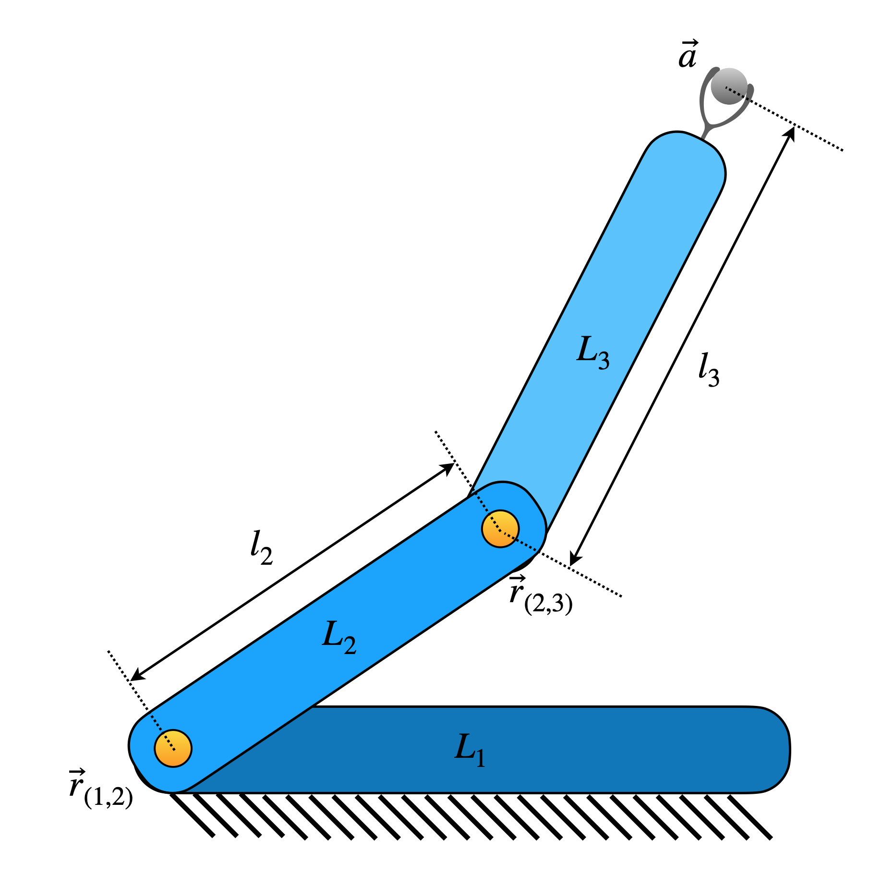

# Automatic Computation for Robot Design (ACRoD)

## Description

This repository is dedicated to develop functions for automatic computations for designing robotic manipulators.

## Currently available functions

- Jacobian formulation for planar and spatial manipulators around a given end-effector point. (This is useful in performing optimisation of Jacobian-based performance parameters of any non-redundant robot directly from its robot-topology matrix)
  - **Statement of need:** Jacobian formulation is highly used in dimensional synthesis of robotic manipulators, which deals with optimal design of robot's dimensional parameters (link-lengths and joint-orientations). For a given topological structure, formulating Jacobian around a given end-effector point for designing optimal dimensional parameters would require only the topological information, as every other step can be automated. Formulating Jacobian for serial manipulators is easy but for parallel manipulators and serial-parallel hybrid manipulators it is more complicated and often tedious. ACRoD automates this task of formulating Jacobian for a given end-effector point by running all the required steps in the background. The targetted audience includes researchers and engineers working on performing dimensional synthesis of manipulators (especially for multiple manipultors in bulk for comparison) to compute optimal dimensions for operation around a single end-effector point, and those needing to verify the DOF of a topological structure (especially for those special cases of kinematic mechanisms where Chebychev–Grübler–Kutzbach criterion fails to accurately determine the DOF) by analysing the Jacobian.

## Installation

The package can be installed from PyPI by using the following command via terminal.
```shell
pip install acrod
```

## Usage

### Jacobian for robotic manipulators

#### 2R Planar Serial Robot (as an example)

<p align="center">
    
</p>

The topological information of a robot is to be specified by using its robot-topology matrix, as defined [here](./misc/Robot_Topology_Matrix.md). For a planar 2R serial manipulator (as shown in the above figure), the robot topology matrix is given by

$$\left[\begin{matrix}
9 & 1 & 0 \\\\
1 & 9 & 1 \\\\
0 & 1 & 9
\end{matrix}\right]$$

The corresponding Jacobian function can be formulated as follows.

Firstly, the required functions are imported as shown below.
```py
from acrod.jacobian import Jacobian
from numpy import array
```


The robot-topology matrix for 3R planar serial manipulator is defined and jacobian information is processed via the imported jacobian class as follows.
```py
M = array(
        [[9, 1, 0],
         [1, 9, 1],
         [0, 1, 9]]
    )
jac = Jacobian(M, robot_type = 'planar')
```


Jacobian function is generated as shown below.
```py
jacobian_function = jac.get_jacobian_function()
```


In the process of generating the above jacobian function, other attributes of the jacobian object also are updated. Symbolic Jacobian matrices can be extracted from the attributes. Since this is a serial robot, the matrix $J_a$ itself would be the Jacobian matrix of the manipulator. The matrix $J_a$ is extracted from `Ja` attribute of the jacobian object as follows.
```py
symbolic_jacobian = jac.Ja
symbolic_jacobian
```

In an ipynb file of JupyterLab, the above code would produce the following output.

$$\left[\begin{matrix}- a\_{y} + r\_{(1,2)y} & - a\_{y} + r\_{(2,3)y} \\\\ a\_{x} - r\_{(1,2)x} & a\_{x} - r\_{(2,3)x} \\\\ 1 & 1\end{matrix}\right]$$

The above Jacobian is based on the notations defined and described [here](./misc/Notation_and_Nomenclature.md).

Active joint velocities, in the corresponding order, can be viewed by running the following lines.
```py
active_joint_velocities = jac.active_joint_velocities_symbolic
active_joint_velocities
```

In an ipynb file of JupyterLab, the above code would produce the following output.

$$\left[\begin{matrix}\dot{\theta}\_{(1,2)} \\\\ \dot{\theta}\_{(2,3)}\end{matrix}\right]$$

Robot dimensional parameters can be viewed by running the below line.
```py
robot_dimensional_parameters = jac.parameters_symbolic
robot_dimensional_parameters
```

In an ipynb file of JupyterLab, the above code would produce the following output.

$$\left[\begin{matrix}r_{(1,2)x} \\\\ r_{(1,2)y} \\\\ r_{(2,3)x} \\\\ r_{(2,3)y}\end{matrix}\right]$$


Robot end-effector parameters can be viewed by running the below line.
```py
robot_endeffector_parameters = jac.endeffector_variables_symbolic
robot_endeffector_parameters
```

In an ipynb file of JupyterLab, the above code would produce the following output.

$$\left[\begin{matrix}a_{x} \\\\ a_{y}\end{matrix}\right]$$

#### Sample computation of Jacobian for the configuration corresponding to the parameters shown below:

- End-effector point: $\textbf{a}=\hat{i}+2\hat{j}$
- Locations of joints: $\textbf{r}\_{(1,2)}=3\hat{i}+4\hat{j}$ and $\textbf{r}\_{(2,3)}=5\hat{i}+6\hat{j}$

For the given set of dimensional parameters of the robot, the numerical Jacobian can be computed as follows. Firstly, we need to gather the configuration parameters in Python list format, in a particular order. The robot dimensional parameters from `jac.parameters_symbolic` are found (as shown earlier) to be in the order of $r_{(1,2)x}$, $r_{(1,2)y}$, $r_{(2,3)x}$ and $r_{(2,3)y}$. Hence the configuration parameters are to be supplied in the same order, as a list. Thus, the computation can be performed as shown below.
```py
end_effector_point = [1,2]
configuration_parameters = [3,4,5,6]
jacobian_at_the_given_configuration = jacobian_function(end_effector_point, configuration_parameters)
jacobian_at_the_given_configuration
```

The output produced by running the above code, is shown below.
```py
array([[ 2,  4],
       [-2, -4],
       [ 1,  1]])
```

Mathematical concepts behind formulating the Jacobian can be found [here](./misc/Mathematics_behind_Jacobian_formulation.md).

#### Dimensional Synthesis

For dimensional synthesis, at least a performance parameter is required. One commonly used performance parameter in dimensional synthesis is the condition number. From the above Jacobian function, the condition number can be found by computing the ratio of maximum singular value and minimum singular value. This condition number has the bounds $(1,\infty)$. When the condition number is 1, that signifies the best performance in the context of condition number. The computation of condition number from a given Jacobian can be achieved by the code shown below:

```py
from numpy.linalg import svd

def condition_number_func(jacobian_matrix):
    _, singular_values, _ = svd(jacobian_matrix)
    condition_number =  singular_values.max()/singular_values.min()
    return condition_number
```

For reference if we take the joint at the fixed link to be at the origin, the dimensional synthesis for optimal performance around the end-effector point $\textbf{a}=\hat{i}+2\hat{j}$ can be performed by the code shown below:

```py
from scipy.optimize import minimize
from numpy import hstack, ones

end_effector_point = [1,2]
base_reference_point = [0,0]
r12 = base_reference_point
jac_fun = lambda y: jacobian_function(end_effector_point, hstack((base_reference_point,y)))
condition_number = lambda z: condition_number_func(jac_fun(z))
initial_guess = ones(len(jac.parameters)-len(base_reference_point))
res = minimize(condition_number, initial_guess)
r23 = res.x
```

The link lengths $l_2$ and $l_3$ are given by $l_2 = \lVert \textbf{r}\_{12}-\textbf{r}\_{23} \rVert$ and $l_3 = \lVert\textbf{r}\_{23}-\textbf{a}\rVert$. By using the code below, the link lengths of 2R robot can be computed.

```py
from numpy.linalg import norm

l2 = norm(r23-r12)
l3 = norm(r23-end_effector_point)
print(l2,l3,res.fun)
```
Output:
```py
3.4641016153289317 2.236067976155377 1.0000000007904777
```
The above output shows that for $l_2=3.464$ and $l_3=2.236$, the robot has the condition number approximately equal to $1.0$, which signifies optimal performance.

## Examples

Some examples (along with their mathematical derivations) can be found [here](./examples/Jacobian).

## Full Documentation

For full documentation, visit the documentation page [here](https://acrod.readthedocs.io/en/latest/).

## Community Guidelines

- For contribution to the software:
  - In order to contribute to the software, please consider using the [pull request feature](https://github.com/suneeshjacob/ACRoD/pulls) of GitHub.
- For reporting issues with the software:
  - For reporting issues or problems, please use [issues](https://github.com/suneeshjacob/ACRoD/issues).
- For support:
  - For any further support (including installation, usage, etc.), feel free to contact via suneeshjacob-at-gmail-dot-com.
