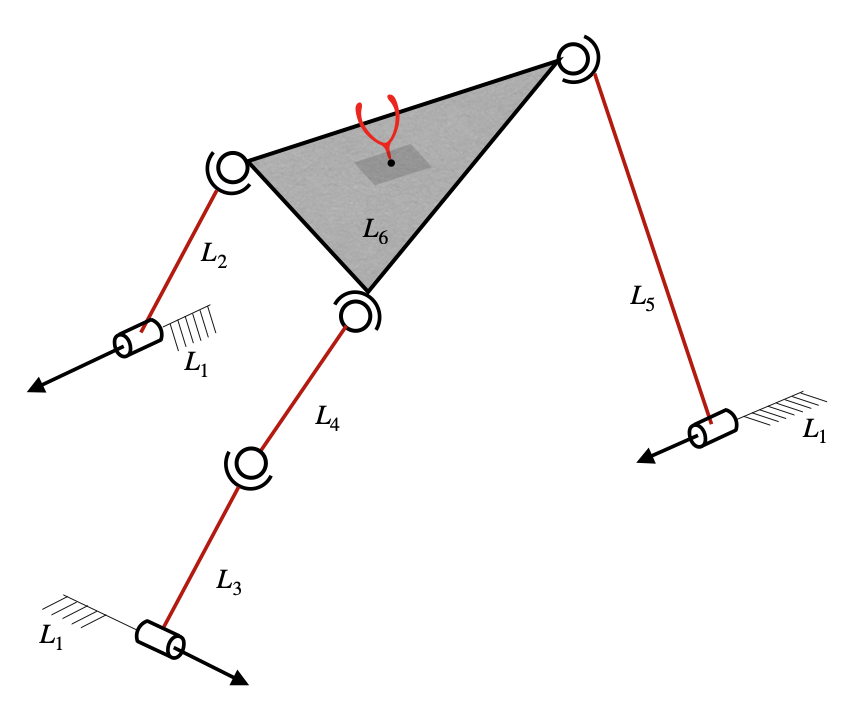

# RSSR-SSR Spatial Parallel Robot

## Mathematics involved

    

The RSSR-SSR Serial-Parallel Hybrid Robot is taken from [[1]](#1), and a picture [[2]](#2) of the robot is shown in the above figure. The corresponding adjacency matrix is given by

$$M = \left[\begin{matrix}L_1 & R & R & O & R & O\\\\A & L_2 & O & O & O & S\\\\A & O & L_3 & S & O & O\\\\O & O & O & L_4 & O & S\\\\O & O & O & O & L_5 & S\\\\O & O & O & O & O & L_6\end{matrix}\right]$$

All the steps that are followed in the previous example would follow here as well, except in step 7, the superfluous DOF comes into picture. If step 7 is not done, then the system of equations shown in \eqref{eq:velocities_v2toN} would be insufficient to represent the passive joint velocities in terms of active joint velocities. This is due to the fact that the fourth link has rotation along its longitudinal axis not controllable with the actuators yet does not affect the end-effector's velocity. Performing pseudo-inverse can fix this issue but pseudo-inverse could be a discontinuous operation near singular values. Also to enable the calculation of mobility of the robotic mechanism, the additional equation for each such superfluous DOF is calculated as per the method shown in algorithm 3 of the main document.

-----

### Connecting paths:

All possible paths connecting the end-effector link from the base link, are shown below.

$$
\begin{matrix}
    \text{Path 1:} \\;\\;\\; L_1-L_2-L_6 \\ 
    \text{Path 2:} \\;\\;\\; L_1-L_3-L_4-L_6 \\ 
    \text{Path 3:} \\;\\;\\; L_1-L_5-L_6
\end{matrix}
$$

In order to check for possibility of redundant paths, the rank of the connectivity matrix is considered.

$$
\begin{matrix}
    \bf{v}^{(1)}=\bf{V}_{(1,2)}+\bf{V}_{(2,6)} \\ 
    \bf{v}^{(2)}=\bf{V}_{(1,3)}+\bf{V}_{(3,4)}+\bf{V}_{(4,6)} \\ 
    \bf{v}^{(3)}=\bf{V}_{(1,5)}+\bf{V}_{(5,6)} \\
\end{matrix}
$$

$$
\Rightarrow \begin{Bmatrix}
    \bf{v}^{(1)} \\
    \bf{v}^{(2)} \\
    \bf{v}^{(3)} 
\end{Bmatrix} = 
\begin{bmatrix}
    1 & 1 & 0 & 0 & 0 & 0 & 0 \\
    0 & 0 & 1 & 1 & 1 & 0 & 0 \\
    0 & 0 & 0 & 0 & 0 & 1 & 1 
\end{bmatrix}
\begin{Bmatrix}
    \bf{V}_{(1,2)} \\
    \bf{V}_{(2,6)} \\
    \bf{V}_{(1,3)} \\
    \bf{V}_{(3,4)} \\
    \bf{V}_{(4,6)} \\
    \bf{V}_{(1,5)} \\
    \bf{V}_{(5,6)} 
\end{Bmatrix}
$$

$$
\Rightarrow \begin{Bmatrix}
    \bf{v}^{(k)}
\end{Bmatrix} = 
\begin{bmatrix}
    \bf{C}_{\bf{V}}
\end{bmatrix}
\begin{Bmatrix}
    \bf{V}_{(i,j)}
\end{Bmatrix}
$$

Even though there are 4 equations, the rank of the matrix $[\bf{C}\_{\bf{V}}]$ is 3. This shows that only three independent connecting paths from base to end-effector exist and hence one of the paths should be redundant. The set of independent connecting paths can be found by performing the row-reduced echelon form or the row echelon form of $[\bf{C}\_{\bf{V}}]^T$. The set of indices of pivot columns indicates that the set of corresponding paths are independent. By performing row-reduced echelon form on $[\bf{C}\_{\bf{V}}]^T$, the list of pivot columns is $(1,2,3)$, and hence the paths 1, 2 and 3 amount to a set of independent paths.

Now, given that the independent connecting paths are the first three paths, the angular velocity connectivity matrix is considered as follows.

$$
\begin{matrix}
    \bf{\omega}^{(1)}=\bf{\Omega}_{(1,2)}+\bf{\Omega}_{(2,6)} \\ 
    \bf{\omega}^{(2)}=\bf{\Omega}_{(1,3)}+\bf{\Omega}_{(3,4)}+\bf{\Omega}_{(4,6)} \\ 
    \bf{\omega}^{(3)}=\bf{\Omega}_{(1,5)}+\bf{\Omega}_{(5,6)} \\
\end{matrix}
$$

The $\bf{\Omega}\_{(i,j)}$ terms corresponding to prismatic joints, i.e., $\bf{\Omega\_{(1,2)}}$, $\bf{\Omega\_{(1,3)}}$, $\bf{\Omega\_{(2,4)}}$ and $\bf{\Omega\_{(3,4)}}$ are set to zero. The equations would then become

$$
\begin{matrix}
    \bf{\omega}^{(1)}=\bf{\Omega}_{(1,2)}+\bf{\Omega}_{(2,6)} \\ 
    \bf{\omega}^{(2)}=\bf{\Omega}_{(1,3)}+\bf{\Omega}_{(3,4)}+\bf{\Omega}_{(4,6)} \\ 
    \bf{\omega}^{(3)}=\bf{\Omega}_{(1,5)}+\bf{\Omega}_{(5,6)} \\
\end{matrix}
$$

$$
\Rightarrow \begin{Bmatrix}
    \bf{\omega}^{(1)} \\
    \bf{\omega}^{(2)} \\
    \bf{\omega}^{(3)} 
\end{Bmatrix} = 
\begin{bmatrix}
    1 & 1 & 0 & 0 & 0 & 0 & 0 \\
    0 & 0 & 1 & 1 & 1 & 0 & 0 \\
    0 & 0 & 0 & 0 & 0 & 1 & 1 
\end{bmatrix}
\begin{Bmatrix}
    \bf{\Omega}_{(1,2)} \\
    \bf{\Omega}_{(2,6)} \\
    \bf{\Omega}_{(1,3)} \\
    \bf{\Omega}_{(3,4)} \\
    \bf{\Omega}_{(4,6)} \\
    \bf{\Omega}_{(1,5)} \\
    \bf{\Omega}_{(5,6)} 
\end{Bmatrix}
$$

$$
\Rightarrow \begin{Bmatrix}
    \bf{\omega}^{(k)}
\end{Bmatrix} = 
\begin{bmatrix}
    \bf{C}_{\Omega}
\end{bmatrix}
\begin{Bmatrix}
    \bf{\Omega}_{(i,j)}
\end{Bmatrix}
$$

The rank of the matrix $[\bf{C_{\Omega}}]$ is 2, even though there are three equations. Hence, only two independent equations exist. The set of independent connecting paths can be found by performing row-reduced echelon form or echelon form on $[\bf{C_{\Omega}}]^T$. The set of indices of pivot columns would indicate the set of corresponding independent paths in the context of angular velocity. By performing row-reduced echelon form on $[\bf{C_{\Omega}}]^T$, the list of pivoted columns is found to be (1,3), and hence the paths 1 and 3 amount to a set of independent paths in the context of angular velocity.

Therefore, the independent linear velocities are $\bf{v}^{(1)}$, $\bf{v}^{(2)}$ and $\bf{v}^{(3)}$, and the independent angular velocities are $\bf{\omega}^{(1)}$ and $\bf{\omega}^{(3)}$.

$$\bf{v}^{(1)}=\dot{d}\_{(1,2)} \bf{\hat{n}\_{(1,2)}} + \dot{d}\_{(2,4)} \bf{\hat{n}\_{(2,4)}} + \dot{\theta}\_{(4,5)} \bf{\hat{k}} \times \left( \bf{a} - \bf{r}\_{(4,5)} \right) + \dot{\theta}\_{(5,7)} \bf{\hat{k}} \times \left( \bf{a} - \bf{r}\_{(5,7)} \right)$$

$$\bf{v}^{(2)}=\dot{d}\_{(1,3)} \bf{\hat{n}}\_{(1,3)} + \dot{d}\_{(3,4)} \bf{\hat{n}}\_{(3,4)} + \dot{\theta}\_{(4,5)} \bf{\hat{k}} \times \left( \bf{a} - \bf{r}\_{(4,5)} \right) + \dot{\theta}\_{(5,7)} \bf{\hat{k}} \times \left( \bf{a} - \bf{r}\_{(5,7)} \right)$$

$$\bf{v}^{(3)}=\dot{d}\_{(1,2)} \bf{\hat{n}}\_{(1,2)} + \dot{d}\_{(2,4)} \bf{\hat{n}}\_{(2,4)} + \dot{\theta}\_{(4,6)} \bf{\hat{k}} \times \left( \bf{a} - \bf{r}\_{(4,6)} \right) + \dot{\theta}\_{(6,7)} \bf{\hat{k}} \times \left( \bf{a} - \bf{r}\_{(6,7)} \right)$$

$$\bf{\omega}^{(1)} = \dot{\theta}\_{(4,5)} \bf{\hat{k}} + \dot{\theta}\_{(5,7)} \bf{\hat{k}}$$

$$\bf{\omega}^{(3)} = \dot{\theta}\_{(4,6)} \bf{\hat{k}} + \dot{\theta}\_{(6,7)} \bf{\hat{k}}$$

$$
\begin{Bmatrix}\bf{v}^{(1)} \\\\ \bf{\omega}^{(1)}\end{Bmatrix} = \begin{Bmatrix}\bf{v} \\\\ \bf{\omega}\end{Bmatrix} = \left[\begin{matrix}- a_{y} + r_{(4,5)y} & n_{(1,2)x} & 0\\\\a_{x} - r_{(4,5)x} & n_{(1,2)y} & 0\\\\1 & 0 & 0\end{matrix}\right]\begin{Bmatrix}\dot{\theta}\_{(4,5)}\\\\\dot{d}\_{(1,2)}\\\\\dot{d}\_{(1,3)}\end{Bmatrix} + \left[\begin{matrix}0 & - a_{y} + r_{(5,7)y} & 0 & n_{(2,4)x} & 0\\\\0 & a_{x} - r_{(5,7)x} & 0 & n_{(2,4)y} & 0\\\\0 & 1 & 0 & 0 & 0\end{matrix}\right]\begin{Bmatrix}\dot{\theta}\_{(4,6)}\\\\\dot{\theta}\_{(5,7)}\\\\\dot{\theta}\_{(6,7)}\\\\\dot{d}\_{(2,4)}\\\\\dot{d}\_{(3,4)}\end{Bmatrix}
$$

Constraint equations:

$$
\begin{Bmatrix}\bf{v}^{(2)}-\bf{v}^{(1)} \\\\ \bf{v}^{(3)}-\bf{v}^{(1)} \\\\ \bf{\omega}^{(3)}-\bf{\omega}^{(1)}\end{Bmatrix} = \bf{0}
$$

$$
\Rightarrow \left[\begin{matrix}0 & - n_{(1,2)x} & n_{(1,3)x}\\\\0 & - n_{(1,2)y} & n_{(1,3)y}\\\\a_{y} - r_{(4,5)y} & 0 & 0\\\\- a_{x} + r_{(4,5)x} & 0 & 0\\\\-1 & 0 & 0\end{matrix}\right]\begin{Bmatrix}\dot{\theta}\_{(4,5)}\\\\\dot{d}\_{(1,2)}\\\\\dot{d}\_{(1,3)}\end{Bmatrix} + \left[\begin{matrix}0 & 0 & 0 & - n_{(2,4)x} & n_{(3,4)x}\\\\0 & 0 & 0 & - n_{(2,4)y} & n_{(3,4)y} \\\\- a_{y} + r_{(4,6)y} & a_{y} - r_{(5,7)y} & - a_{y} + r_{(6,7)y} & 0 & 0 \\\\a_{x} - r_{(4,6)x} & - a_{x} + r_{(5,7)x} & a_{x} - r_{(6,7)x} & 0 & 0 \\\\1 & -1 & 1 & 0 & 0 \end{matrix}\right]\begin{Bmatrix}\dot{\theta}\_{(4,6)}\\\\\dot{\theta}\_{(5,7)}\\\\\dot{\theta}\_{(6,7)}\\\\\dot{d}\_{(2,4)}\\\\\dot{d}\_{(3,4)}\end{Bmatrix}=\begin{Bmatrix} 0 \\\\ 0 \\\\ 0\end{Bmatrix}
$$

$$
\bf{J_a} = \left[\begin{matrix}- a_{y} + r_{(4,5)y} & n_{(1,2)x} & 0\\\\a_{x} - r_{(4,5)x} & n_{(1,2)y} & 0\\\\1 & 0 & 0\end{matrix}\right]
$$

$$
\bf{J_p} = \left[\begin{matrix}0 & - a_{y} + r_{(5,7)y} & 0 & n_{(2,4)x} & 0\\\\0 & a_{x} - r_{(5,7)x} & 0 & n_{(2,4)y} & 0\\\\0 & 1 & 0 & 0 & 0\end{matrix}\right]
$$

$$
\bf{A_a} = \left[\begin{matrix}0 & - n_{(1,2)x} & n_{(1,3)x}\\\\0 & - n_{(1,2)y} & n_{(1,3)y}\\\\a_{y} - r_{(4,5)y} & 0 & 0\\\\- a_{x} + r_{(4,5)x} & 0 & 0\\\\-1 & 0 & 0\end{matrix}\right]
$$

$$\bf{A_p} = \left[\begin{matrix}0 & 0 & 0 & - n_{(2,4)x} & n_{(3,4)x} \\\\0 & 0 & 0 & - n_{(2,4)y} & n_{(3,4)y} \\\\- a_{y} + r_{(4,6)y} & a_{y} - r_{(5,7)y} & - a_{y} + r_{(6,7)y} & 0 & 0 \\\\a_{x} - r_{(4,6)x} & - a_{x} + r_{(5,7)x} & a_{x} - r_{(6,7)x} & 0 & 0 \\\\1 & -1 & 1 & 0 & 0 \end{matrix}\right]$$

$$
\bf{\widetilde{J}} = \bf{J_a}-\bf{J_p}\bf{A^{-1}\_p}\bf{A_a}
$$

-----

In step 7, since the manipulator has more than two spherical joints, the list of all possible combinations C of dividing the manipulator into two parts is considered. Since there are six links and since 6 is an odd number, ${}^{6}C_{1}+{}^{6}C_{2}+{}^{6}C_{3}=41$ distinct combinations exist, out of which the combination $[\{4\}, \{1,2,3,5,6\}]$ is discussed in detail in this sub-section. This combination has $c_1 = \{4\}$ and $c_2 = \{1,2,3,5,6\}$. And by grouping the links of each part together, the topology-matrix can be rewritten as shown in equation \eqref{eq:adjmat_RSSRSSR_superfluous}, from which the coupling matrix can be extracted to be as shown in \eqref{eq:couplingmatrix}.

$$\widetilde{M} = \begin{bmatrix}
    L_4 & O & O & S & O & S \\\\
    O & L_1 & R & R & R & O \\\\
    O & A & L_2 & O & O & S \\\\
    O & A & O & L_3 & O & O \\\\
    O & O & O & O & L_5 & S \\\\
    O & O & O & O & O & L_6
    \end{bmatrix}$$

$$\widetilde{C} = \left[\begin{matrix}O & O & S & O & S\end{matrix}\right]$$

It can be seen that the coupling matrix has only two spherical joints and no other joint. This shows that the two parts $c_1$ and $c_2$ are connected by two spherical joints alone and no other joint. And it can also be seen that both the base link (first link) and the end-effector link (last link), i.e., both the links $1$ and $6$, lie in one part of the combination, i.e., in $c_2$. Hence, $c_{be}=c_2$. The corresponding link numbers for each of the two spherical joints are $3,4$ and $4,6$. Since $3,6\in c_{be}$, the sequences $(i,j)$ and $(k,l)$ are considered to be $(3,4)$ and $(4,6)$, respectively. Since $j$ and $k$ are the same link (link 4), the superfluous link $s$ would be link $4$. Only one of the connecting paths $P$ happens to contain the link $4$ for this particular case, and that is $(1,3,4,6)$. If the path is truncated at the superfluous link, it would become $(1,3,4)$. Hence, absolute angular velocity of link 4, formulated through this truncated path, is given by equation \eqref{eq:angvelsupflulink_forexample3}.

$$\bf{\omega}\_{s} = \bf{\Omega}\_{(1,3)} + \bf{\Omega}\_{(3,4)} \Rightarrow \bf{\omega}\_{s} = \dot{\theta}\_{(1,3)}\bf{\hat{n}}\_{(1,3)} + \bf{\omega}\_{(3,4)}$$

Therefore, the additional equation corresponding to this superfluous DOF can be formulated as shown in equation \eqref{eq:supfludofeqn_forexample3}. This needs to be added to the system of equations shown in equation \eqref{eq:velocities_v2toN}, in order to make $\bf{A_p}$ a square matrix, with which the passive joint velocities can be written in terms of active joint velocities.

$$\bf{\omega}\_{s}\cdot \left(\bf{r}\_{(3,4)}-\bf{r}\_{(4,6)}\right) = 0$$

## References
<a id="1">[1]</a> 
Muralidharan V, Bandyopadhyay S (2019) "A two-degree-of-freedom rssr-ssr manipulator for sun-tracking." In: Badodkar DN, Dwarakanath TA (eds) Machines, Mechanism and Robotics. Springer Singapore, Singapore, pp 135–147

<a id="2">[2]</a> 
Jacob, Akkarapakam Suneesh, and Rituparna Datta. "A Generalised Method for Multi-objective Optimisation of Performance Parameters for Dimensional Synthesis of Robotic Manipulators Around a Specified End-effector Point" International Journal of Intelligent Robotics and Applications ***(submitted)**** (2022).
