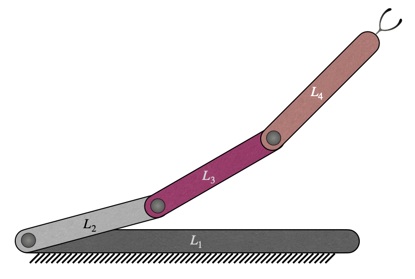

# 3R Serial Robot

## Mathematics involved

    

An RRR planar serial manipulator is considered as shown in the figure \ref{fig:RRR}. The corresponding adjacency matrix is given by

$$\bf{M} = \left[\begin{matrix}L_1 & R & O & O \\\\A & L_2 & R & O\\\\O & A & L_3 & R\\\\O & O & A & L_4\end{matrix}\right]$$

### Connecting paths:

$$\text{Path 1:}\\;\\;\\;\\;L_1-L_2-L_3-L_4$$

Since this has only one connecting path, if the manipulator represented by the matrix is valid then it must be a serial manipulator. Hence, there would be only one independent set of formulation of linear and angular velocities, and formulation of $[\bf{C}\_{V}]$ and $[\bf{C}\_{\Omega}]$ are not required.

The following are the linear and angular velocity contributions to the end-effector from each joint of the path, which are calculated by using the formulation shown in table \ref{velocities} and by using the convention that all the revolute joints of a planar manipulator would have their axes on the xy-plane, thereby reducing the unit vector along each axis to $\bf{\hat{n}}\_{(i,j)}=\bf{\hat{k}}$, as mentioned in equation 20 of the main document.

$$\begin{matrix}
  \bf{V_{12}}=\dot{\theta}\_{(1,2)} \bf{\hat{n}\_{(1,2)}} \times \left( \bf{a} - \bf{r}\_{(1,2)} \right) = \dot{\theta}\_{(1,2)} \bf{\hat{k}} \times \left( \bf{a} - \bf{r}\_{(1,2)} \right) \\
  \bf{V_{23}}=\dot{\theta}\_{(2,3)} \bf{\hat{n}\_{(2,3)}} \times \left( \bf{a} - \bf{r}\_{(2,3)} \right) = \dot{\theta}\_{(2,3)} \bf{\hat{k}} \times \left( \bf{a} - \bf{r}\_{(2,3)} \right) \\
  \bf{V_{34}}=\dot{\theta}\_{(3,4)} \bf{\hat{n}\_{(3,4)}} \times \left( \bf{a} - \bf{r}\_{(3,4)} \right) = \dot{\theta}\_{(3,4)} \bf{\hat{k}} \times \left( \bf{a} - \bf{r}\_{(3,4)} \right)
\end{matrix}
$$

$$\begin{matrix}
  \bf{\Omega_{12}}=\dot{\theta}\_{(1,2)} \bf{\hat{n}\_{(1,2)}} = \dot{\theta}\_{(1,2)} \bf{\hat{k}} \\
  \bf{\Omega_{23}}=\dot{\theta}\_{(2,3)} \bf{\hat{n}\_{(2,3)}} = \dot{\theta}\_{(2,3)} \bf{\hat{k}} \\
  \bf{\Omega_{34}}=\dot{\theta}\_{(3,4)} \bf{\hat{n}\_{(3,4)}} = \dot{\theta}\_{(3,4)} \bf{\hat{k}}
\end{matrix}
$$

Therefore, the linear and angular velocities are given by \eqref{eq:RRR_linvel} and \eqref{eq:RRR_angvel}, respectively.

$$\bf{v}^{(1)}=\dot{\theta}\_{(1,2)} \bf{\hat{k}} \times \left( \bf{a} - \bf{r}\_{(1,2)} \right) + \dot{\theta}\_{(2,3)} \bf{\hat{k}} \times \left( \bf{a} - \bf{r}\_{(2,3)} \right) + \dot{\theta}\_{(3,4)} \bf{\hat{k}} \times \left( \bf{a} - \bf{r}\_{(3,4)} \right)$$

$$\bf{\omega}^{(1)}=\dot{\theta}\_{(1,2)} \bf{\hat{k}} + \dot{\theta}\_{(2,3)} \bf{\hat{k}} + \dot{\theta}\_{(3,4)} \bf{\hat{k}}$$

Since this is a planar manipulator, the case of superfluous DOF does not come into picture.

If the actuating joint velocities vector is considered to be $\bf{\Omega_a} = \\{\dot{\theta}\_{(1,2)} \\; \dot{\theta}\_{(2,3)} \\; \dot{\theta}\_{(3,4)}\\}^T$, the velocity of the end-effector is given by

$$\begin{Bmatrix}\bf{v} \\\\ \bf{\omega}\end{Bmatrix} = \begin{Bmatrix}\bf{v}^{(1)} \\\\ \bf{\omega}^{(1)}\end{Bmatrix} = \left[\begin{matrix}- a_{y} + r_{(1,2)y} & - a_{y} + r_{(2,3)y} & - a_{y} + r_{(3,4)y} \\\\a_{x} - r_{(1,2)x} & a_{x} - r_{(2,3)x} & a_{x} - r_{(3,4)x}\\\\1 & 1 & 1\end{matrix}\right]\begin{Bmatrix}\dot{\theta}\_{(1,2)}\\\\\dot{\theta}\_{(2,3)}\\\\\dot{\theta}\_{(3,4)}\end{Bmatrix}$$

$$
\Rightarrow \begin{Bmatrix}\bf{v} \\\\ \bf{\omega}\end{Bmatrix} = \bf{J_a} \bf{\Omega_a}
$$

Therefore, the Jacobian of the manipulator is

$$
\bf{\widetilde{J}} = \bf{J_a} = \left[\begin{matrix}- a_{y} + r_{(1,2)y} & - a_{y} + r_{(2,3)y} & - a_{y} + r_{(3,4)y}\\\\a_{x} - r_{(1,2)x} & a_{x} - r_{(2,3)x} & a_{x} - r_{(3,4)x}\\\\1 & 1 & 1\end{matrix}\right]
$$

Since it is a serial manipulator, the matrices $\bf{J_p}$, $\bf{A_a}$ and $\bf{A_p}$ do not come into picture.

